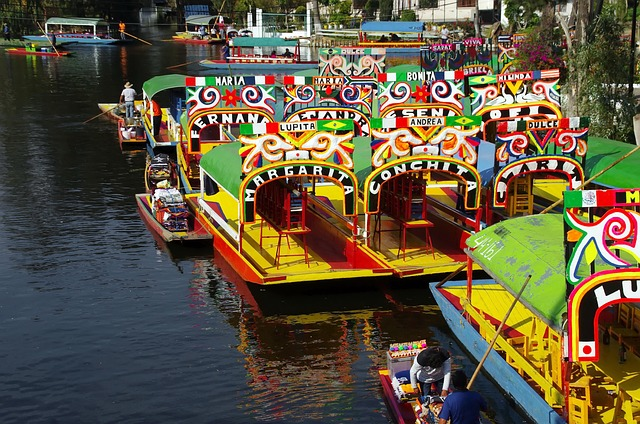

# Compte rendu Oral : Projet Site Web MexiGO

## Présentation du Groupe
- **Groupe** : Yanis, Ilerioluwa, Maxence et Abdoulaye
- **Thème** : Site web touristique sur le Mexique
- **Nom du site** : MexiGO (inspiré du Mexique et de l'idée de voyage)

## Introduction au Projet
### Objectif
Créer un site web touristique présentant le Mexique sous un angle attractif : activités, gastronomie et patrimoine. Le site vise à donner envie aux visiteurs de découvrir le pays à travers une agence fictive spécialisée.

### Choix du Thème
- Le Mexique est riche en culture, histoire et traditions.
- Pays diversifié : plages, montagnes, jungles, déserts.
- Gastronomie reconnue par l'UNESCO.
- Population chaleureuse et fêtes traditionnelles.

### Répartition des Tâches
- **Yanis et Abdoulaye** : Partie réseau (connexion sécurisée, accès fiable).
- **Ilerioluwa et Maxence** : Développement web (pages HTML, CSS, JavaScript).

## Réalisation Technique
### Technologies Utilisées
- **HTML5** : Structure des pages (balises sémantiques : `<header>`, `<section>`, `<footer>`, etc.).
- **CSS3** : Mise en page, couleurs, polices (Google Fonts : Arimo, Fira Sans), responsive design.
- **JavaScript** : Interactions (animation bouton scroll, validation formulaire).
- **Ressources externes** : Font Awesome pour icônes, images locales.

### Structure du Site
#### Page Accueil (Accueil.html)
- **Header** : Logo et navigation (Accueil, Activités, Gastronomie).
- **Landing page** : Titre "Bienvenidos a México" avec image de fond.
- **Sections** :
  - Introduction à l'agence.
  - Présentation (Qui sommes-nous ?, Promesse).
  - Équipe (Conseillers spécialisés).
  - Services (Itinéraires sur mesure, réservations, assistance 24/7).
  - Disponibilité (Lieux couverts : Mexico City, Cancún, etc.).
  - Tarifs (Forfaits indicatifs).
  - Réputation (Témoignages clients).
  - Contact (Formulaire avec validation JS).
- **Footer** : Copyright, contact, CGV.

#### Page Activités (activites.html)
- **Introduction** : Présentation du Mexique (diversité, culture).
- **Lieux touristiques** : Descriptions de Mexico, Cancún, Playa del Carmen, Guanajuato.
- **Photos** : Grille d'images avec noms et estimations de prix.
- **Footer** : Identique à l'accueil.

#### Page Gastronomie (Gastronomie.html)
- **Plats emblématiques** : Tacos, Guacamole, Mole poblano (images + descriptions).
- **Footer** : Identique.

### Design et Ergonomie
- **Couleurs** : Rouge (#e63946) pour header, vert pour accents, fond crème (#fffaf5).
- **Polices** : Arimo pour texte, Fira Sans pour titres.
- **Responsive** : Meta viewport pour mobiles.
- **Accessibilité** : Attributs `alt` pour images, balises sémantiques.
- **Animations** : Scroll smooth, rebond du bouton scroll.

### Fonctionnalités JavaScript
- **Bouton Scroll** : Animation de rebond, défilement vers section contact/photos.
- **Validation Formulaire** : Vérification nom, email, message ; alerte erreurs ou succès.

## Ressources et Apprentissages
### Ressources Utilisées
- Sites web, ChatGPT et Gemini pour recherche.
- Document fourni en cours.
- Tutoriels YouTube (ex: https://youtu.be/6hCGTJCo_Uo).
- Bibliothèques : Font Awesome, Google Fonts.

### Compétences Développées
- **Techniques** : Maîtrise HTML/CSS/JS de base.
- **Réseau** : Sécurité informatique, protocoles de connexion.
- **Organisationnelles** : Travail d'équipe, répartition tâches.

## Difficultés Rencontrées
- Coordination entre réseau et développement.
- Intégration des images et responsive design.
- Validation formulaire côté client (pas serveur).

## Résultats et Évaluation
### Fonctionnalités Réalisées
- Site complet avec 3 pages navigables.
- Design cohérent et attractif.
- Interactions basiques fonctionnelles.

### Améliorations Possibles
- Ajout de backend pour formulaire réel.
- Plus de pages (ex: Histoire, Culture).
- Optimisation SEO et performance.

## Conclusion
Ce projet nous a permis de combiner programmation web, gestion réseau et découverte culturelle. Nous avons acquis des compétences solides en développement front-end et en travail collaboratif. Le site MexiGO est une vitrine touristique réussie pour promouvoir le Mexique.

### Questions pour l'Audience
- Quelles fonctionnalités ajouteriez-vous ?
- Comment améliorer l'accessibilité ?

## Technologies et Outils Utilisés : Explications Détaillées

Dans cette section, nous détaillons tous les éléments utilisés dans le projet MexiGO. Pour chaque technologie ou outil, nous expliquons son rôle principal, comment il fonctionne techniquement, ce qu'il apporte au projet, et pourquoi il a été choisi. Nous incluons des exemples concrets issus du code pour illustrer son utilisation pratique.

### 1. HTML5 (HyperText Markup Language)
**Rôle principal** : HTML5 est le langage de base pour structurer le contenu des pages web. Il organise le texte, les images et les éléments interactifs en une hiérarchie logique, séparant le contenu visible (corps de la page) des informations techniques (en-tête).

**Comment ça marche techniquement** : HTML utilise des balises (tags) ouvrantes et fermantes pour entourer le contenu. Par exemple, `<p>` définit un paragraphe. Le navigateur web analyse ces balises et les transforme en éléments visuels sur la page. Les attributs (comme `src` pour les images ou `href` pour les liens) ajoutent des propriétés spécifiques. HTML5 introduit des balises sémantiques (comme `<header>`, `<section>`) pour améliorer l'accessibilité et le référencement SEO.

**Ce que ça apporte au projet** : Sans HTML, il n'y aurait pas de structure de base. Il permet de créer des pages navigables et accessibles, essentielles pour un site touristique comme MexiGO où l'information doit être claire et organisée.

**Pourquoi choisi** : C'est le standard moderne pour le web, compatible avec tous les navigateurs, et facile à apprendre pour des débutants.

**Exemples détaillés** :
- **Balise `<header>`** : Utilisée pour l'en-tête de chaque page. Elle contient le logo et le menu de navigation. Dans Accueil.html, elle permet de regrouper ces éléments en haut de la page pour une navigation intuitive.
  ```html
  <header class="header">
      
      <nav class="nav">
          <li><a href="Accueil.html">Accueil</a></li>
          <li><a href="activites.html">Activités</a></li>
          <li><a href="Gastronomie.html">Gastronomie</a></li>
      </nav>
  </header>
  ```
  Ici, `` affiche l'image du logo, et `<nav>` structure le menu avec des liens (`<a>`) vers d'autres pages.
- **Balise `<section>`** : Définit des parties logiques de la page, comme l'introduction. Dans activites.html, elle regroupe le texte descriptif du Mexique, facilitant la lecture et l'organisation.
  ```html
  <section class="intro">
      <p class="intro1">Le Mexique est un pays trés riche en histoire...</p>
      
  </section>
  ```
  La balise `` intègre une image illustrative, avec `alt` pour l'accessibilité (texte alternatif si l'image ne charge pas).
- **Balise `<form>`** : Crée un formulaire interactif pour le contact. Dans Accueil.html, elle permet aux utilisateurs de saisir des informations (nom, email, message) et de les envoyer (simulation côté client).
  ```html
  <form action="#" method="post" class="contact-form" novalidate>
      <div class="form-row">
          <label for="nom">Nom</label>
          <input id="nom" name="nom" type="text" required>
      </div>
      <button type="submit" class="btn-primary">Envoyer ma demande</button>
  </form>
  ```
  `<label>` lie le texte au champ `<input>`, et `required` force la saisie obligatoire.

### 2. CSS3 (Cascading Style Sheets)
**Rôle principal** : CSS stylise l'apparence des éléments HTML, contrôlant couleurs, polices, espacements et layouts pour rendre le site visuellement attrayant.

**Comment ça marche techniquement** : CSS fonctionne par règles : un sélecteur (ex: `.header`) cible un élément HTML, suivi de propriétés (ex: `color: red;`). Les règles sont "cascadées" – la plus spécifique l'emporte. Il peut être interne (dans `<style>`), externe (fichier .css lié) ou inline. CSS3 ajoute des fonctionnalités avancées comme Flexbox pour les layouts et animations.

**Ce que ça apporte au projet** : Transforme la structure HTML brute en un design professionnel. Pour MexiGO, il crée un thème cohérent (rouge/vert) et responsive, essentiel pour attirer des touristes.

**Pourquoi choisi** : Indispensable pour le web moderne, permet un design sans images lourdes, et s'intègre facilement avec HTML.

**Exemples détaillés** :
- **Importation de polices externes** : Utilise `@import` pour charger des polices de Google Fonts, améliorant la lisibilité et le style sans installer de fichiers locaux.
  ```css
  @import url('https://fonts.googleapis.com/css2?family=Fira+Sans:ital,wght@0,100..900&display=swap');
  ```
  Appliqué dans accueil.css, cela permet d'utiliser 'Fira Sans' pour les titres, rendant le site plus moderne.
- **Stylisation du header** : Utilise Flexbox (`display: flex`) pour aligner logo et menu horizontalement, avec couleurs et padding pour un look professionnel.
  ```css
  header.header {
      display: flex;
      justify-content: space-between;
      align-items: center;
      background-color: #e63946;
      padding: 10px 20px;
  }
  ```
  `justify-content: space-between` espace les éléments, créant un équilibre visuel.
- **Responsive design avec media queries** : Bien que non utilisé pleinement ici, c'est une fonctionnalité clé pour adapter le site aux mobiles. Exemple théorique :
  ```css
  @media (max-width: 768px) {
      .big-title { font-size: 50px; }
  }
  ```
  Cela réduit la taille du titre sur petits écrans, améliorant l'UX.
- **Flexbox pour layout** : Organise les éléments en lignes/colonnes flexibles. Dans activités.css, pour la grille de photos :
  ```css
  .photo-lieu {
      display: flex;
      flex-wrap: wrap;
  }
  ```
  `flex-wrap: wrap` permet aux éléments de passer à la ligne sur petits écrans.

### 3. JavaScript (JS)
**Rôle principal** : Ajoute de l'interactivité dynamique aux pages statiques HTML/CSS, comme des animations ou validations.

**Comment ça marche techniquement** : JS s'exécute côté client (dans le navigateur). Il manipule le DOM (modèle objet du document) pour changer le contenu ou le style en réponse à des événements (clics, soumissions). Utilise des fonctions et des écouteurs d'événements (`addEventListener`).

**Ce que ça apporte au projet** : Rend le site plus engageant. Pour MexiGO, il valide les formulaires et anime le bouton scroll, améliorant l'expérience utilisateur sans recharger la page.

**Pourquoi choisi** : Langage natif du web, léger et puissant pour les interactions front-end basiques.

**Exemples détaillés** :
- **Animation du bouton scroll** : Utilise `setInterval` pour un rebond visuel et `scrollIntoView` pour un défilement fluide vers une section.
  ```js
  const scrollBtn = document.querySelector('.scroll');
  if (scrollBtn) {
      scrollBtn.addEventListener('click', function(e) {
          e.preventDefault();
          const target = document.querySelector('#contact');
          if (target) {
              target.scrollIntoView({ behavior: 'smooth' });
          }
      });
      setInterval(() => {
          scrollBtn.style.transform = 'translateY(-5px)';
          setTimeout(() => {
              scrollBtn.style.transform = 'translateY(0)';
          }, 500);
      }, 2000);
  }
  ```
  `querySelector` sélectionne l'élément, `addEventListener` écoute le clic, et `scrollIntoView` défile doucement.
- **Validation de formulaire** : Vérifie les champs avant envoi, affichant des alertes pour les erreurs.
  ```js
  const form = document.querySelector('.contact-form');
  if (form) {
      form.addEventListener('submit', function(e) {
          e.preventDefault();
          const nom = document.getElementById('nom').value.trim();
          const email = document.getElementById('email').value.trim();
          const message = document.getElementById('message').value.trim();
          let isValid = true;
          let errors = [];
          if (!nom) {
              errors.push('Le nom est obligatoire.');
              isValid = false;
          }
          const emailRegex = /^[^\s@]+@[^\s@]+\.[^\s@]+$/;
          if (!email || !emailRegex.test(email)) {
              errors.push('Un email valide est obligatoire.');
              isValid = false;
          }
          if (!message) {
              errors.push('Le message est obligatoire.');
              isValid = false;
          }
          if (isValid) {
              alert('Formulaire envoyé avec succès ! (Simulation - en vrai, envoyez à un serveur)');
              form.reset();
          } else {
              alert('Erreurs :\n' + errors.join('\n'));
          }
      });
  }
  ```
  `preventDefault` bloque l'envoi réel, `trim()` nettoie les espaces, et `regex` valide l'email.

### 4. Images et Médias
**Rôle principal** : Fournissent du contenu visuel pour illustrer et engager les utilisateurs.

**Comment ça marche techniquement** : Les images sont stockées localement (dossier `image/`) et référencées via `` ou en CSS (`background-image`). Le navigateur les charge et les affiche. Formats courants : JPG pour photos, PNG pour logos.

**Ce que ça apporte au projet** : Rend le site plus attractif et crédible. Les photos de destinations mexicaines incitent à voyager.

**Pourquoi choisi** : Essentiel pour un site touristique ; locales pour éviter les dépendances externes.

**Exemples détaillés** :
- **Image de fond en CSS** : Utilisée pour la landing page, couvrant toute la section sans répétition.
  ```css
  section.top-page {
      background: url("image/Fond-ecran.jpg");
      background-size: cover;
      background-position: center;
      height: 80vh;
  }
  ```
  `cover` étire l'image pour remplir l'espace, `center` la centre.
- **Image en HTML** : Pour les conseillers ou plats, avec `alt` pour l'accessibilité.
  ```html
  
  ```
  Si l'image ne charge pas, "Conseiller — Maria" s'affiche.

### 5. Polices Google Fonts
**Rôle principal** : Offre des polices gratuites et variées pour améliorer la typographie.

**Comment ça marche techniquement** : Importées via une URL dans CSS, chargée depuis les serveurs Google. Pas besoin d'installer localement.

**Ce que ça apporte au projet** : Polices professionnelles (Arimo pour texte, Fira Sans pour titres) rendent le site plus lisible et moderne.

**Pourquoi choisi** : Gratuit, large choix, et optimise le chargement web.

**Exemples détaillés** :
- **Import** : Charge la police depuis Google.
  ```css
  @import url('https://fonts.googleapis.com/css2?family=Arimo&display=swap');
  ```
- **Utilisation** : Applique la police à tous les éléments ou spécifiques.
  ```css
  * { font-family: 'Arimo'; }
  .big-title { font-family: 'Fira Sans'; font-weight: 900; }
  ```
  `*` applique à tout, `.big-title` surcharge pour les titres.

### 6. Font Awesome
**Rôle principal** : Bibliothèque d'icônes vectorielles scalables.

**Comment ça marche techniquement** : Icônes ajoutées via classes CSS (ex: `fas fa-angle-down`). Chargée depuis un CDN (réseau de distribution).

**Ce que ça apporte au projet** : Ajoute des icônes (flèche pour scroll) sans fichiers locaux, économisant de l'espace.

**Pourquoi choisi** : Gratuit, facile à utiliser, et vectoriel (pas de pixelisation).

**Exemples détaillés** :
- **Icône en HTML** : Intégrée dans un lien pour le bouton scroll.
  ```html
  <a class="scroll" href="#contact">Scroll <i class="fas fa-angle-down"></i></a>
  ```
  `<i>` avec classe affiche la flèche.
- **Lien dans `<head>`** : Charge la bibliothèque.
  ```html
  <link rel="stylesheet" href="https://cdnjs.cloudflare.com/ajax/libs/font-awesome/6.2.0/css/all.min.css">
  ```

### 7. Structure de Projet
**Rôle principal** : Organise les fichiers pour une maintenance facile.

**Comment ça marche techniquement** : Fichiers séparés par type (HTML pour contenu, CSS pour style, JS pour logique). Dossier `image/` pour médias.

**Ce que ça apporte au projet** : Facilite les modifications (changer un style sans toucher le HTML) et la collaboration.

**Pourquoi choisi** : Bonne pratique web, évite le code spaghetti.

**Exemples détaillés** :
- **Arborescence** :
  - Accueil.html : Structure de la page d'accueil.
  - activites.html : Page activités.
  - accueil.css : Styles pour l'accueil.
  - activités.css : Styles pour activités.
  - script.js : Interactions communes.
  - image/ : Photos (mexico.jpg, tacos.jpg, etc.).

### 8. Outils de Développement
**Rôle principal** : Aident à coder, tester et versionner le projet.

**Comment ça marche techniquement** : VS Code édite le code avec coloration syntaxique. Navigateurs testent avec outils dev (console pour JS). Git versionne les changements.

**Ce que ça apporte au projet** : Accélère le développement et corrige les erreurs.

**Pourquoi choisi** : Gratuits et populaires dans la communauté web.

**Exemples détaillés** :
- **VS Code** : Éditeur avec extensions pour HTML/CSS/JS.
- **Navigateur** : Ouvrir Accueil.html pour voir le rendu ; inspecter éléments pour déboguer CSS.
- **Git/GitHub** : Non utilisé ici, mais recommandé pour `git add .` puis `git commit -m "Ajout page accueil"`.

---

**Annexes** :
- Captures d'écran des pages.
- Code source (HTML/CSS/JS).
- Liens vers ressources utilisées.
