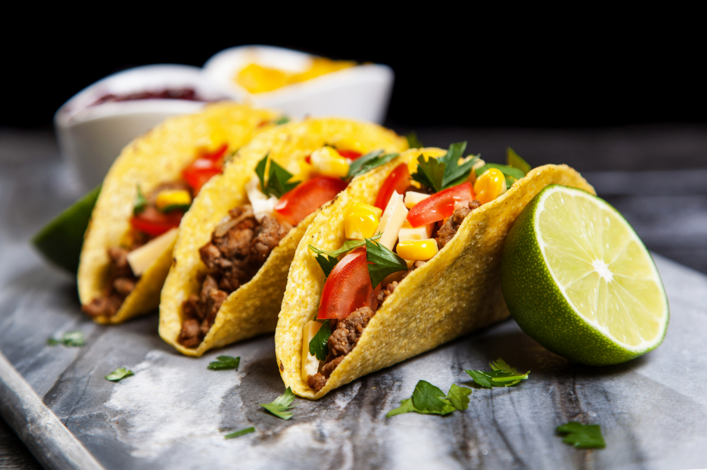

# Explication Détaillée des Programmes du Projet MexiGO

Ce document détaille chaque fichier et composant du projet MexiGO. Pour chaque "programme" (fichier HTML, CSS, JS, etc.), nous expliquons son rôle, sa structure, ses fonctionnalités clés, et comment il s'intègre dans le projet global. Les exemples sont tirés directement du code source.

## 1. Accueil.html (Page d'Accueil)
**Rôle** : Page principale du site, point d'entrée pour les visiteurs. Présente l'agence MexiGO, ses services, équipe, tarifs, et formulaire de contact.

**Structure générale** :
- `<head>` : Métadonnées (titre, encodage, viewport, liens CSS/JS, icônes).
- `<body>` : Contenu visible, divisé en sections (`<section>`) pour l'organisation logique.

**Fonctionnalités clés** :
- **Header** : Logo et navigation vers autres pages.
- **Landing page** : Titre accrocheur avec image de fond et bouton scroll.
- **Sections multiples** : Introduction, présentation, équipe, services, disponibilité, tarifs, réputation, contact.
- **Formulaire** : Champs pour nom, email, destination, message ; bouton envoi.
- **Footer** : Informations légales et contact.

**Intégration** : Lie accueil.css pour le style, script.js pour les interactions. Sert de hub vers activites.html et Gastronomie.html.

**Exemple clé** :
```html
<section class="contact" id="contact">
    <h3>Parlons de votre projet</h3>
    <form action="#" method="post" class="contact-form" novalidate>
        <div class="form-row">
            <label for="nom">Nom</label>
            <input id="nom" name="nom" type="text" required>
        </div>
        <!-- Autres champs -->
        <button type="submit" class="btn-primary">Envoyer ma demande</button>
    </form>
</section>
```
Ce formulaire permet la saisie utilisateur, validé par JS.

## 2. activites.html (Page Activités)
**Rôle** : Présente les destinations touristiques mexicaines (Mexico, Cancún, etc.), avec descriptions et photos.

**Structure générale** :
- `<head>` : Similaire à Accueil.html, lie activités.css.
- `<body>` : Header, landing page, sections intro, développement (textes), photos (grille d'images), footer.

**Fonctionnalités clés** :
- **Introduction** : Texte descriptif du Mexique avec image.
- **Section développement** : Listes (`<li>`) des lieux avec estimations de prix.
- **Section photos** : Grille Flexbox d'images avec overlays (nom + prix).
- **Navigation** : Liens vers Accueil.html et Gastronomie.html.

**Intégration** : Utilise activités.css pour layout responsive. Images depuis image/. Pas de JS spécifique ici.

**Exemple clé** :
```html
<section class="photos" id="photos">
    <div class="photo-lieu">
        <a class="lieu-mexi Mexico">
            <div class="lieu-detail">
                <p class="nom-ville">Mexico</p>
                <p class="estimation">1000€</p>
            </div>
        </a>
        <!-- Autres lieux -->
    </div>
</section>
```
Affiche les destinations avec prix, encourageant les clics (bien que liens non fonctionnels).

## 3. Gastronomie.html (Page Gastronomie)
**Rôle** : Met en avant la cuisine mexicaine avec plats emblématiques (tacos, guacamole, mole).

**Structure générale** :
- `<head>` : Lie gastronomie.css.
- `<body>` : Header, landing page, section plats (flex layout avec images + textes), footer.

**Fonctionnalités clés** :
- **Section plats** : Chaque plat dans un `<div class="plat">` avec image et description.
- **Layout** : Flexbox pour aligner image et texte horizontalement.

**Intégration** : gastronomie.css pour styles. Images culinaires depuis image/.

**Exemple clé** :
```html
<div class="plat">
    
    <div class="plat-text">
        <h2>Tacos</h2>
        <p>Tortillas garnies de viande, légumes et sauce épicée...</p>
    </div>
</div>
```
Présente visuellement les plats pour attirer les gourmands.

## 4. accueil.css (Feuille de Style pour Accueil)
**Rôle** : Définit l'apparence de Accueil.html (couleurs, polices, layouts).

**Structure générale** :
- Imports : Polices Google Fonts, Font Awesome.
- Règles générales : Reset (*), body, html.
- Sections spécifiques : header, top-page, landing-page, intro, etc.

**Fonctionnalités clés** :
- **Flexbox** : Pour header (logo + nav), services grid.
- **Couleurs** : Rouge pour header, vert pour accents.
- **Responsive** : Meta viewport, mais peu de media queries.
- **Animations** : Scroll smooth, hover sur boutons.

**Intégration** : Lié dans Accueil.html. Utilise images pour fonds.

**Exemple clé** :
```css
section.top-page {
    background: url("image/Fond-ecran.jpg");
    background-size: cover;
    background-position: center;
    height: 80vh;
}
```
Crée la landing page immersive.

## 5. activités.css (Feuille de Style pour Activités)
**Rôle** : Style pour activites.html (layouts, images, responsive).

**Structure générale** :
- Imports similaires.
- Règles pour header, top-page, intro, develop, photos, footer.

**Fonctionnalités clés** :
- **Flexbox** : Grille de photos (.photo-lieu), plats.
- **Images** : Backgrounds pour lieux, overlays pour détails.
- **Responsive** : flex-wrap pour mobiles.

**Intégration** : Lié dans activites.html.

**Exemple clé** :
```css
.photo-lieu {
    min-height: 500px;
    display: flex;
    flex-wrap: wrap;
}
.lieu-mexi {
    background-size: cover;
    background-position: center;
    min-width: 350px;
    height: 500px;
    flex: 1;
}
```
Organise les photos en grille adaptable.

## 6. gastronomie.css (Feuille de Style pour Gastronomie)
**Rôle** : Style pour Gastronomie.html (plats, layout).

**Structure générale** :
- Imports.
- Règles pour header, top-page, plats, footer.

**Fonctionnalités clés** :
- **Flexbox** : .plat pour image + texte.
- **Images** : Bordures arrondies, ombres.

**Intégration** : Lié dans Gastronomie.html.

**Exemple clé** :
```css
.plat {
    display: flex;
    align-items: center;
    gap: 30px;
    margin-bottom: 40px;
}
.plat img {
    width: 300px;
    height: auto;
    border-radius: 10px;
    box-shadow: 0 4px 8px rgba(0,0,0,0.2);
}
```
Présente les plats de manière élégante.

## 7. script.js (JavaScript Commun)
**Rôle** : Ajoute interactions dynamiques à toutes les pages (validation formulaire, animation scroll).

**Structure générale** :
- Fonctions pour bouton scroll et formulaire.
- Utilise DOM : querySelector, addEventListener.

**Fonctionnalités clés** :
- **Bouton scroll** : Animation rebond, défilement smooth vers #contact.
- **Validation formulaire** : Vérifie champs, alerte erreurs/succès, reset.

**Intégration** : Lié dans Accueil.html (et potentiellement autres). Fonctionne sur toutes les pages avec éléments correspondants.

**Exemple clé** :
```js
const form = document.querySelector('.contact-form');
if (form) {
    form.addEventListener('submit', function(e) {
        e.preventDefault();
        const nom = document.getElementById('nom').value.trim();
        // Validation...
        if (isValid) {
            alert('Formulaire envoyé avec succès !');
            form.reset();
        } else {
            alert('Erreurs :\n' + errors.join('\n'));
        }
    });
}
```
Gère l'envoi simulé du formulaire.

## 8. Dossier image/ (Médias)
**Rôle** : Stocke toutes les images (logos, photos de destinations, plats, conseillers).

**Contenu** :
- Logo.png : Logo de l'agence.
- Fond-ecran.jpg : Image de fond landing.
- mexico.jpg, Cancùn.jpg, etc. : Photos de lieux.
- tacos.jpg, guacamole.jpg, etc. : Plats.
- conseiller1.jpg, etc. : Équipe.

**Fonctionnement** : Référencées dans HTML/CSS via src ou background-image. Formats JPG/PNG pour optimisation.

**Intégration** : Essentiel pour visuels ; sans elles, le site serait texte-only.

## 9. Projet Site Web.txt (Notes de Projet)
**Rôle** : Document texte avec notes initiales (raccourcis HTML, liens ressources).

**Contenu** : Conseils comme "!" pour générer HTML, liens YouTube, sites d'inspiration.

**Intégration** : Référence pour développement ; pas intégré au site.

## 10. Compte rendu Projet numéro 1.md (Rapport Initial)
**Rôle** : Rapport de groupe sur le projet (objectifs, tâches, apprentissages).

**Contenu** : Sections sur groupe, réalisation, balises HTML/CSS, ressources.

**Intégration** : Base pour le compte rendu oral ; documentation séparée.

---

Ce document couvre tous les programmes du projet. Chaque fichier est expliqué pour faciliter la compréhension et la maintenance.
