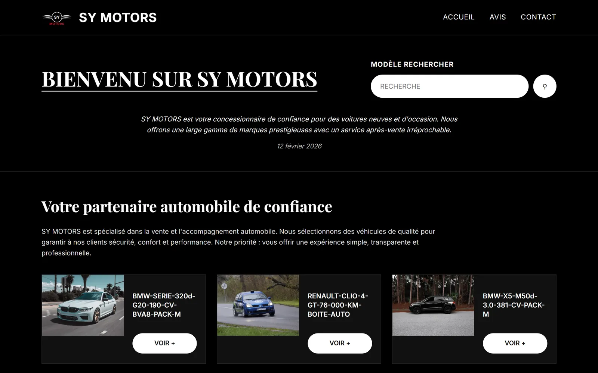
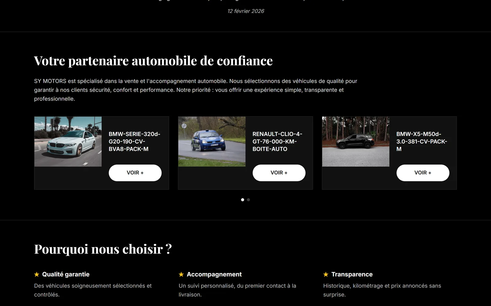
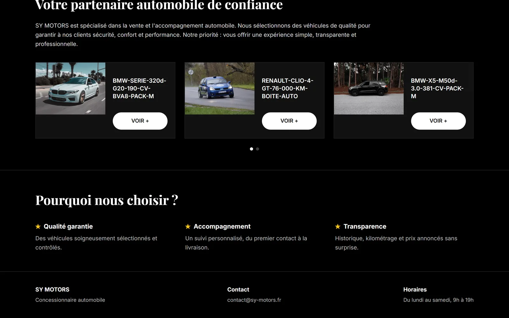

# SY Motors, catalogue en ligne d'un concessionnaire

Site vitrine développé sous WordPress pour un vendeur de voitures neuves et
d'occasion. Réalisé gratuitement pour un proche, dans un cadre scolaire, sur
environ deux semaines.

> **Le site n'est plus en ligne aujourd'hui.** Ce dossier ne contient donc pas
> de code, seulement les captures d'écran des pages principales. Elles sont
> ci-dessous.

---

## Le besoin

Un concessionnaire dont le stock ne se voyait nulle part en ligne. Pour savoir
ce qui était disponible, il fallait appeler ou passer sur place, et chaque
appel repartait de zéro.

La contrainte principale n'était pas technique : le stock tourne, il fallait
que le gérant puisse ajouter, retirer et modifier un véhicule sans formation et
sans avoir à me rappeler. C'est ce qui a décidé du choix de WordPress plutôt
que d'un site écrit à la main.

---

## Ce que j'ai fait

* Un catalogue où chaque véhicule est une fiche : modèle, motorisation,
  puissance, kilométrage, boîte de vitesses
* Une recherche par modèle dès le haut de la page d'accueil
* Un carrousel de véhicules renvoyant vers les fiches détaillées
* Un bloc « Pourquoi nous choisir » qui répond aux doutes du marché de
  l'occasion : qualité contrôlée, accompagnement, transparence sur
  l'historique et le kilométrage
* Les horaires et l'adresse mail de contact en pied de chaque page

---

## Captures d'écran

**Page d'accueil, avec la recherche par modèle**

**Le catalogue de véhicules, chaque fiche avec sa motorisation et son kilométrage**

**Le bloc « Pourquoi nous choisir » et le pied de page**

---

## Ce que j'en retiens

Le bon outil n'est pas le plus intéressant à coder, c'est celui que le client
peut utiliser seul une fois que je suis parti. Un site écrit à la main aurait
été plus propre techniquement, et inutilisable pour lui au premier véhicule
vendu.
