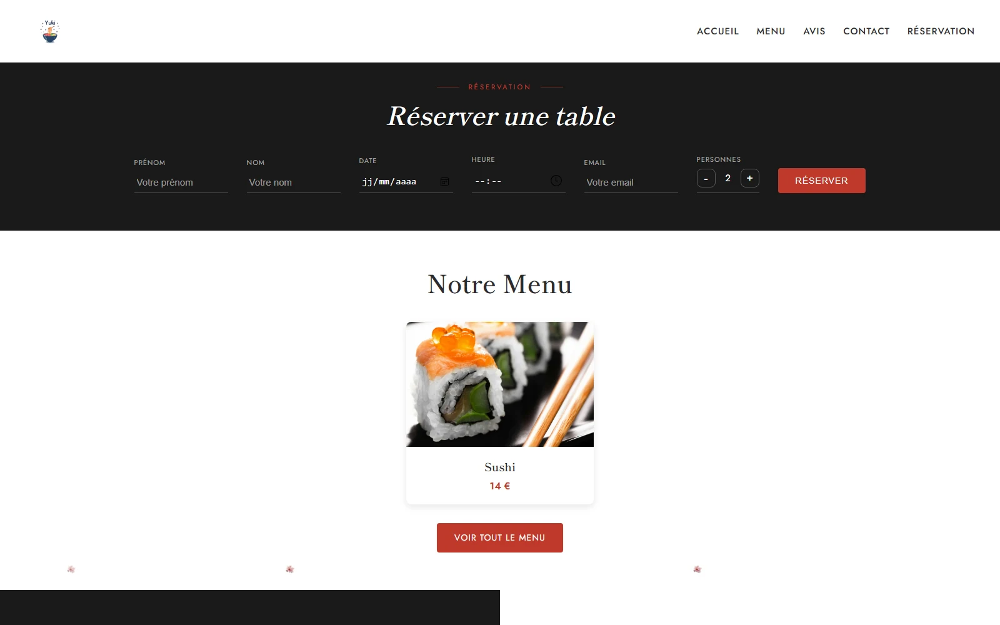
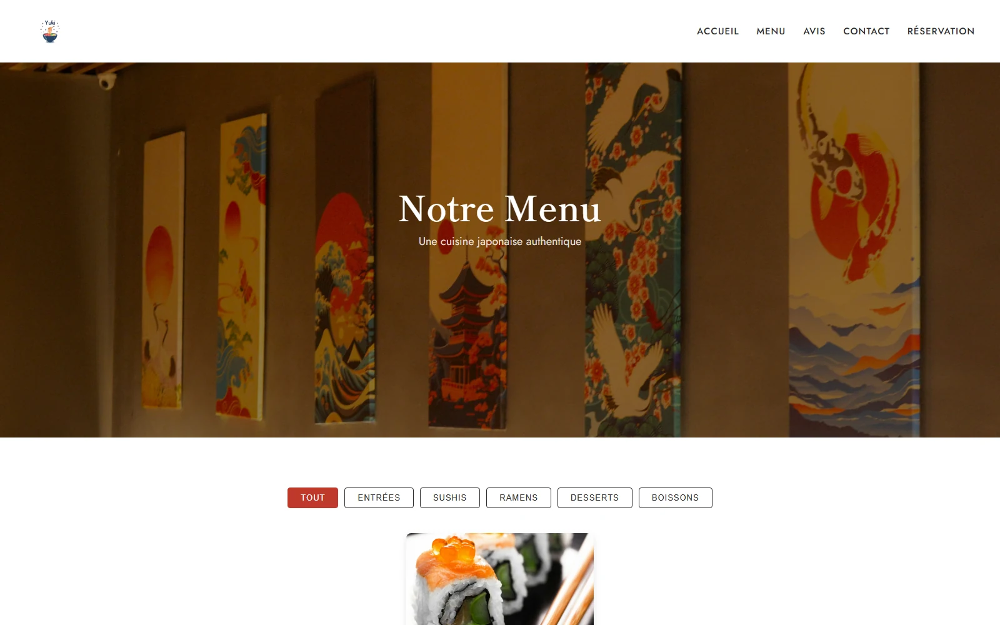
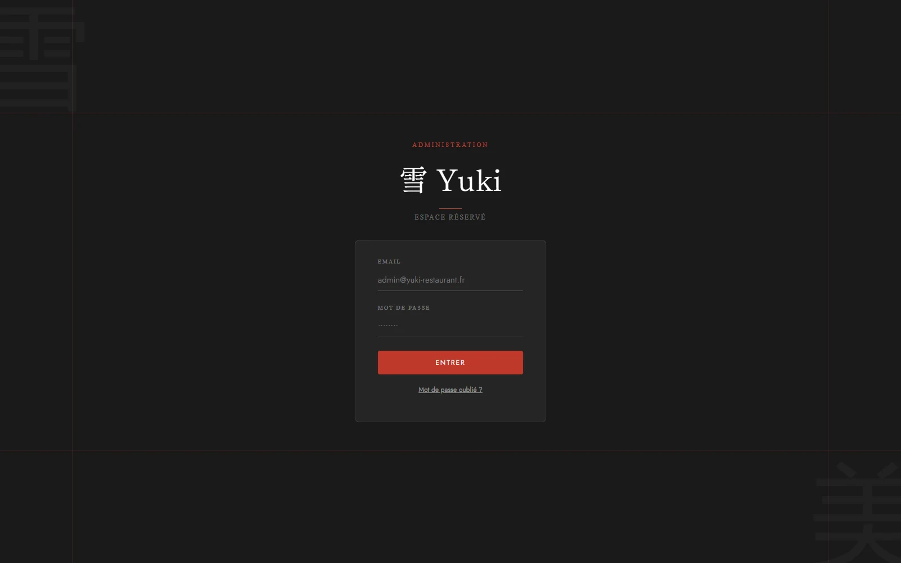

# Yuki, site vitrine d'un restaurant japonais

Site vitrine multi-pages pour un restaurant japonais parisien, avec réservation
en ligne, avis clients et une interface d'administration.

Projet personnel. Le restaurant est fictif, le site a servi de terrain pour
apprendre à brancher une base de données et une authentification sur un site
statique.

🔗 **[Voir le site en ligne](https://olayode-ilerioluwa.github.io/Projet-Portfolio/yuki/)**

---

## Ce que fait le site

**Côté visiteur**

* Page d'accueil : présentation, formulaire de réservation, aperçu du menu,
  avis clients, contact
* Page menu : les plats sont lus depuis la base, pas écrits en dur dans le HTML
* Page avis : consultation et dépôt d'un avis avec une note de 1 à 5
* Réservation : prénom, nom, email, date, heure et nombre de personnes
  (compteur de 1 à 20), envoi d'un mail de confirmation au client et d'une
  notification au restaurant

**Côté administration** (`admin.html`, accès par identifiants)

* Ajouter, modifier et supprimer les plats du menu
* Consulter les réservations reçues, avec un compteur des nouvelles
* Modérer les avis

---

## Captures d'écran

**Accueil**


**Réservation et aperçu du menu, sur la page d'accueil**



**La page menu, avec le filtrage par catégorie**



**La page avis, avec la note moyenne calculée**


**L'administration, protégée par Firebase Auth**



> Les plats et les avis affichés viennent de la base : les captures montrent le
> contenu réel de l'environnement de démonstration, qui est volontairement léger.

---

## Technologies

| Technologie | Usage |
|---|---|
| HTML5 / CSS3 | Structure et mise en page, responsive |
| JavaScript (vanilla) | Toute la logique, sans framework |
| Firebase Firestore | Plats, réservations et avis |
| Firebase Auth | Connexion de l'administrateur |
| EmailJS | Envoi des mails de confirmation |
| Google Fonts | Playfair Display, Lato |

---

## Sécurité des données

Les règles d'accès à la base sont dans [`firestore.rules`](firestore.rules).
Elles ne sont pas une formalité : le site est public, donc n'importe qui peut
appeler la base depuis son navigateur. C'est la règle qui décide, pas le
JavaScript de la page.

* **Plats** : lecture publique, écriture réservée à l'administrateur connecté
* **Réservations** : un visiteur peut en créer une, mais **personne ne peut les
  lire** sans être connecté. Elles contiennent des noms et des emails
* **Avis** : lecture et dépôt publics, modification et suppression réservées à
  l'administrateur

Chaque création est validée côté serveur avant d'être acceptée : champs
autorisés, types, longueurs maximales, format d'email, note comprise entre 1
et 5. Un formulaire trafiqué depuis la console du navigateur est rejeté par la
base elle-même.

---

## Structure

```
Site_Yuki/
├── index.html / index.css      Accueil : à propos, réservation, menu, avis, contact
├── menu.html  / menu.css / menu.js    Le menu, chargé depuis Firestore
├── avis.html  / avis.css / avis.js    Les avis clients
├── admin.html / admin.css / admin.js  Interface d'administration
├── style.css                   Styles communs (header, footer, navigation)
├── script.js                   Réservation, avis, animations
├── firebase.js                 Initialisation Firestore et Auth
├── firestore.rules             Règles d'accès à la base
├── PRODUCT.md                  Le cadrage écrit avant de commencer
└── Image/                      Logo et photographies
```

---

## Lancer le projet

Les pages utilisent des modules JavaScript, il faut donc un serveur local
(l'ouverture directe du fichier ne suffit pas) :

```bash
python -m http.server 8000
```

Puis ouvrir <http://localhost:8000/index.html>.

La configuration Firebase présente dans `firebase.js` est une configuration web
publique : elle identifie le projet, elle ne donne aucun droit. Les droits sont
définis par `firestore.rules`.

---

## Ce que j'en retiens

J'ai commencé par écrire le cadrage ([`PRODUCT.md`](PRODUCT.md)) avant la
première ligne de code : à qui s'adresse le site, quel ton, et ce que je ne
voulais pas faire (pas de fond rouge et noir stéréotypé, pas de temple ni de
cerisier). Ça m'a évité de dessiner au hasard.

Le vrai apprentissage a été de comprendre que la sécurité ne se joue pas dans
le formulaire mais dans les règles de la base. Tant que je vérifiais les
champs en JavaScript, je ne vérifiais rien du tout.
